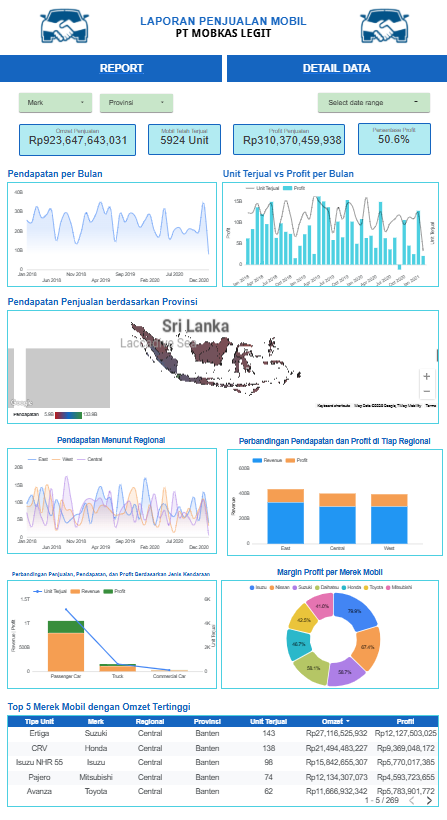

# Car Sales Dashboard - Looker Studio

## 📊 Project Overview
This project presents a **Car Sales Dashboard** built using **Google Looker Studio**.  
The dashboard provides insights into sales performance, revenue, profit, and unit distribution across regions, brands, and vehicle types.  

## 🎯 Objectives
- Analyze total revenue, profit, and units sold.  
- Visualize monthly sales trends and profit margin.  
- Compare performance across regions and vehicle types.  
- Identify top-performing car brands based on revenue and profit.  

## 🛠️ Tools & Technologies
- **Google Looker Studio** (Dashboard & Visualization)  
- **Google Spreadsheet / Excel** (Data Preparation)  

## 📷 Dashboard Preview

## 🔗 Live Dashboard
👉 [View Dashboard Here](https://lookerstudio.google.com/s/v-Lh0OsjslU)  
---
